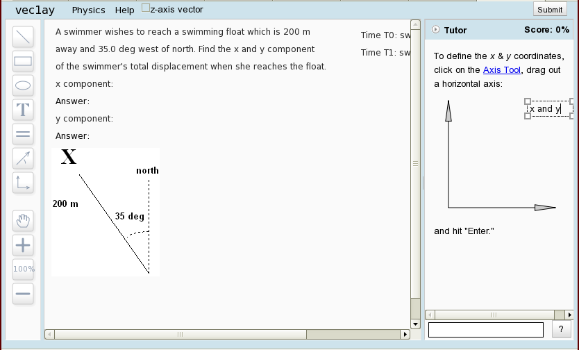

# Instructions for Installing Andes #

The help server itself is a lisp program that stores log data in an 
sql database, and uses a c++ math library called "the solver." 
A front-end web server forwards student help messages
to the Andes help server and serves other static content.
See the [Server Documentation](server.md) for more information.

This installation uses sbcl for lisp, Apache for the web server, MySQL for
the database, and g++ for the solver.  It has been tested on Linux (RedHat 
Enterprise 5.4, CentOS 5.4) and OS X (10.4 and 10.6).

## System Configuration ##

The following packages need to be installed:

    gnu make, git, gnu c++, mysql, mysql-server, mysql-devel,
    apache, wget, and php with mysql

For RedHat-like systems (like CentOS), `mysql-devel` supplies `mysql_config`.
Also, <http://fedoraproject.org/wiki/EPEL> may be helpful. 
The associated install command is:

    yum install make git gcc-c++ mysql mysql-server mysql-devel httpd wget php php-mysql

For Ubuntu (debian systems) you can use the following (as root):

    apt-get install git make g++ libmysqlclient-dev mysql-server \
                apache2 libapache2-mod-proxy-html wget php5 php5-mysql

The Andes help server should be run in an ordinary user account. 
If needed,  set up a user account for the Andes server.  The install,
unless otherwise directed, should be executed by that user. 

For convenience, you can add the user to `/etc/sudoers`.

## Get the Andes code ##

If you wish to contribute code to the Andes project, do the following:
Set up an account for yourself at github, providing your public ssh key;
see "Generating SSH keys" at <http://help.github.com>.
Send your git user name to <help@andestutor.org> so that you can be
added as a collaborator to the Andes project.
To install the Andes repository in directory `andes` use:

    git clone git@github.com:bvds/andes.git andes

Alternatively, if you would just like to use the Andes code:

    git clone git://github.com/bvds/andes.git andes

The rest of the install will take place in the Andes directory.

    cd andes    # switch to the Andes root directory

If you are just running the Andes server, switch to the stable
branch of Andes;  the "master" branch is for development.
In the Andes root directory:

    git checkout --track -b stable origin/stable

For the system to work, a library of problem definitions 
must be included.  The original Andes problem definitions
are under copyright and not publicly available.  For access,
send your ssh public key to help@andestutor.org
(See "Generating SSH keys" at <http://help.github.com>.)
The git command to download this library is:

    git clone ssh://git@andestutor.org/home/git/Andes-problems.git/ problems

Likewise, download the solutions repository:

    git clone ssh://git@andestutor.org/home/git/Andes-solutions.git/ solutions

Compile the solver library and executable:

    make install-solver

## SBCL ##

The sbcl website is <http://sbcl.sourceforge.net>.
A list of all releases can be found at:

  http://sourceforge.net/projects/sbcl/files/

In order to enable thread support and tune the garbage collection 
algorithm, we compile a custom version of sbcl.  First, we download
a binary release and then use that to compile the sbcl source code.

The default sbcl install directory is `/usr/local/`;
If you wish to install in a location other than `/usr/local`
set the environment variable `INSTALL_ROOT` to this location,
for example, `export INSTALL_ROOT=$HOME`, before using the make
command to compile the source code.

    cd lisp-site-install
      make get-binary     # download a binary release
      make get-source     # download and compile source code
      make source-install # install in /usr/local (do as superuser) 
                          #     or in INSTALL_ROOT 
      make sbclrc         # Install the sbcl initialization file ~/.sbclrc
    cd ../

## MySQL database ##

To save session data, we use MySQL. 

First, the MySQL server must be started (not needed in Ubuntu).
As superuser:

    /sbin/chkconfig mysqld on
    /sbin/service mysqld start

Then set the root password (choose your own) and restart:

    /usr/bin/mysqladmin -u root password 'mysql-password'
    /sbin/service mysqld restart

Currently, the root password cannot be empty; see bug #2277.
(In OS X, go to <http://dev.mysql.com>, install MySQL and MySQLStartupItem,
add `/usr/local/mysql/bin` to `PATH` in `~/.profile`,
execute `(cd /usr/local/lib;sudo ln -s ../mysql/lib/lib*.{a,dylib} .)`,
execute `sudo /Library/StartupItems/MySQLCOM/MySQLCOM start`, and
set the root MySQL password using the above command.) 

You can either create a separate user for Andes or use root.
To store the database login credentials, create the file
`db_user_password` in the Andes root directory.
This file should contain, on separate lines,

* the user name for Andes,
* password, and 
* the database name (optional, the default is `andes3`).

This file should be readable by the user and by PHP scripts:

    chmod 640 db_user_password
    sudo chown :apache db_user_password

The command `(start-help)` will access this file for any values
that are not given explicitly.

Funally, set up the tables in the database:

    make install-database

The script will prompt you for a password for the user "open"
The user open will be given the database permissions appropriate
for a researcher under IRB rules.

## Apache Web Server ##

Configure Apache as a reverse proxy server, with json-rpc 
error messages and add links to `DocumentRoot`.
Run with superuser privileges:

    make configure-httpd 

Start up Apache (this step not needed in Ubuntu).  In linux, as superuser:

    /sbin/chkconfig httpd on
    /sbin/service httpd start

if it is already running, use:

    /sbin/service httpd reload

(OS X, use `sudo apachectl start`.  You may need to enable the modules
`proxy_module` and `proxy_http_module` in `/etc/apache2/httpd.conf`.)

If SELinux is running, I suggest you turn it off.  Otherwise, in RedHat:

    sudo system-config-securitylevel # select Customize; select WWW (HTTP)
    sudo chcon -R -t httpd_sys_content_t .  # httpd read permission for Andes files
    sudo setsebool -P httpd_can_network_relay=1  # port forwarding to help server

To test the web server, point a web browser to 

    http://<hostname>/web-UI/login.html

## Javascript ##

Make and build the javascript.  First we need to get 
the Dojo library, then we need to make an Andes-specific
build.  The master branch uses the development version
while the stable branch uses (mostly) the latest release.

    make install-dojo

## Test the Help Server ##

To test the Help Server type "sbcl" to start up lisp, then:

    (rhelp)
    (start-help)

The help server is now running on port 8080.
You can test access to the help server by using telnet:

    telnet localhost 8080
    GET index.html

or try http://localhost:8080 in your web browser.  In either case, the
help server should reply with the "Hunchentoot Default Page."

Next, test that the andes proxy is working.  Using curl:

    curl -i -H "Content-Type: application/json" -XPOST \
      -d'{"method":"open-problem"}' http://localhost/andes-help

The server should reply with response code 200.

Finally, you can test the entire system.  Point a web browser to 

    http://<hostname>/web-UI/login.html

Try to log in and solve a problem.  There will be an initial 
welcome message and intro window;  the screen will look something like
this:   

To stop the server, in lisp:

    (stop-help)    ;Stop the lisp server:
    (quit) ;Exit lisp

If you are just running the server for testing, it may be convenient
to run the help server using
[`screen`](https://www.gnu.org/software/screen)
and detaching the session.
See [Server Documentation](server.md) for further information
on running the help server.
