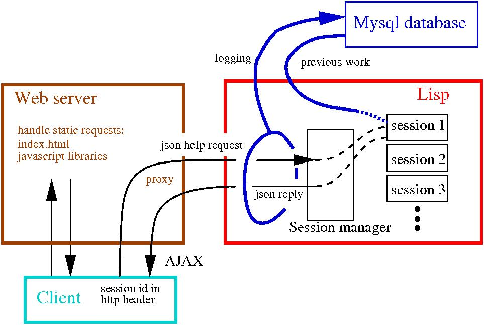

# Andes Help Server #

## Design ##

The Andes Help Server has three main components:

* A conventional web server which serves static content and
  forwards help messages to the help server.

* An SQL database which stores the raw messages passed between the 
  client and the help server. The message protocol is defined using a
  [json-rpc](http://www.jsonrpc.org)
  [service method description](http://dojotoolkit.org/reference-guide/dojox/rpc/smd.html)
  [web-UI/andes/andes3.smd](../web-UI/andes/andes3.smd).
  You can view the messages for 
  [an example session for problem s2e](../web-UI/Documentation/AsuDocs/nokes-example-json.txt).

* The Lisp help server which manages user sessions, logs messages to
  the database, and generates replies to student actions.

A session starts when the client downloads 
[`web-UI/index.html`](../web-UI/index.html)
from the server.  Next, the client downloads various javascript
libraries and sends an `open-problem` message to the help
server.  In response, the help server sets up a new session and returns
the problem statement and any previous work done on the problem. 
As the student solves the problem, various `solution-step`
and `seek-help` messages are sent to the server. 
A session ends when the student hits the submit button or the back
button on the browser. 

## Running the Help Server ##

For normal production use, the Help server will be run as a daemon. 
The daemon starts up a lisp process and runs the contents
of the file [`help-server/init.cl`](../help-server/init.cl). 

To install the help server, or reinstall it, enter the following
command in the Andes root directory (as superuser):

    make install-server

On linux, start the server using (as superuser):

    systemctl start andes-helpd

To stop the server:

    systemctl stop andes-helpd

Monitor status using:

    systemctl status andes-helpd

There are a number of things missing from the server; see
<a href="http://www.andestutor.org/bugzilla/buglist.cgi?query_format=advanced&amp;short_desc_type=allwordssubstr&amp;short_desc=&amp;product=Andes&amp;component=server&amp;long_desc_type=substring&amp;long_desc=&amp;bug_file_loc_type=allwordssubstr&amp;bug_file_loc=&amp;keywords_type=allwords&amp;keywords=&amp;bug_status=NEW&amp;bug_status=ASSIGNED&amp;bug_status=REOPENED&amp;emailassigned_to1=1&amp;emailtype1=substring&amp;email1=&amp;emailassigned_to2=1&amp;emailreporter2=1&amp;emailcc2=1&amp;emailtype2=substring&amp;email2=&amp;bugidtype=include&amp;bug_id=&amp;chfieldfrom=&amp;chfieldto=Now&amp;chfieldvalue=&amp;cmdtype=doit&amp;order=Reuse+same+sort+as+last+time&amp;field0-0-0=noop&amp;type0-0-0=noop&amp;value0-0-0=">Andes Bugzilla, server component</a>.

## Software Updates ##

To update the software, in the Andes root directory, enter: 

    make update

If the help server is running, restart the server using:

    systemctl restart andes-helpd

Once we have <a href="http://www.andestutor.org/bugzilla/show_bug.cgi?id=1722">Bug #1722</a> fixed, we will be able update the lisp server without any server
restart. 

If the server restart fails, 
you may need to rebuild the lisp object files:

* Stop the server:  `systemctl stop andes-helpd`
* You might want to verify directly that the lisp is working: 
   * Start lisp:  `sbcl` 
   * Load the help system:   `(rhelp)`
   * Exit lisp:   `(quit)`
* Start the server:   `systemctl start andes-helpd`

## Monitoring the help server ##

Lisp errors (errors associated with the help server itself) are generally recorded in the database, while client Javascript errors are recorded in the Apache logging.
We have developed some tools for analyzing the help server errors.  These tools can be
accessed on the Andes server at the URL  `http://<server name>/log`.  For instance,
"Show errors and warnings signalled" generates a list of all help system warnings and errors. 
More serious errors server errors, such as losing contact with the database,
are logged in the file `help-server.log`.   Finally, client (javascript)
errors are dumped into the Apache error log file with identifier `andes-client`
(see <a href="http://www.andestutor.org/bugzilla/show_bug.cgi?id=1908">Bug #1908</a>).

Likewise, student comments can be accessed at `http://<server name>/log`
via the link "Comments, with resolution status."
This has proven to be very useful for user testing.

## Resource Limits ##

Each open session uses two system file handles (`fd`s). 
Typically, the help server uses about 30 other `fd`s for other stuff. 
Since the system libray `glibc` has a limit of 1024 `fd`s per
unix process, there is a hard limit of about 450 open sessions per lisp process. 

Currently, the number of simultaneous user sessions is limited by cpu speed. 
On a 32 bit 3.0 GHz Xeon procesor, a single lisp process can handle about
300 simultaneous sessions (using problem s2e as a test case) before full cpu
is used.   On a similar 64 bit machine, 200 simultaneous sessions cause
full usage of 1 cpu.

The timeout for a single turn is set by the variable 
`webserver:*turn-timeout*` to be 20 seconds.   The variable is 
set in [`Base/web-server.cl`](../Base/web-server.cl)
and can be adjusted dynamically in lisp, for example: 
`(setf webserver:*turn-timeout* 15)`

Code for benchmarking Andes using [jmeter](http://jakarta.apache.org/jmeter)
can be found in [`LogProcessing/load-test`](../LogProcessing/load-test).   For longer tests of the help system only, use
[`long-help-only.jmx`](../LogProcessing/load-test/long-help-only.jmx).   When load testing, you want to dump data into
the `andes_test` database, rather than pollute the regular database. 
You can use the following to run the help server:

    (rhelp)
    (start-help :db "andes_test") ;see db_user_password above
    (setf *simulate-loaded-server* nil) ;not necessary in stable branch
    (setf webserver:*debug* nil)        ;not necessary in stable branch
    ;; Create thread to monitor memory usage.
    (sb-thread:make-thread 
     (lambda () (loop for i from 1 to 177 do 
      (format webserver:*stdout* "~%~A sessions~%" 
       (hash-table-count webserver::*sessions*)) 
        (gen-stats webserver:*stdout*) (sleep 120))))

After a run, you can use the following in mysql to flush the
`andes_test` database:

    use andes_test;
    DELETE FROM PROBLEM_ATTEMPT WHERE clientID LIKE '\_%';

## Memory Usage and Garbage collection ##

On a 32 bit linux machine, the lisp process takes up about 
70MBytes while each open session uses roughly 1MByte (depending
on the problem).   Lisp has automatic garbage collection, and 
will need at least as much space for garbage and garbage collection
as it does for data.   Use sbcl flag `--dynamic-space-size`
(in MBytes) to adjust the heap size 
(see `/etc/andes-help.conf`). 
Generally, I have been using 1000 MBytes.

sbcl uses a generational garbage collector.   The basic premise
of the generational garbage collector is that more recently allocated 
data has a better chance of being eligible for garbage collection than
older data.   Unfortunately, the Andes help server breaks this assumption
rather badly:   most of the data gets created at the beginning of a session
and persists until that problem is closed by the student. 
However, the garbage collection algorithm can still be tuned to work 
efficiently:   we use only 2 generations, with rather infrequent
garbage collection.   The function `tune-generational-gc` 
in [`Base/garbage-collect.cl`](../Base/garbage-collect.cl)
is used to set the frequency of garbage collection. 
A larger `bytes-consed-between-gcs` is more efficient,
but causes the system to pause longer during garbage collection. 
I have been targeting 1 second as the maximum acceptable pause. 
